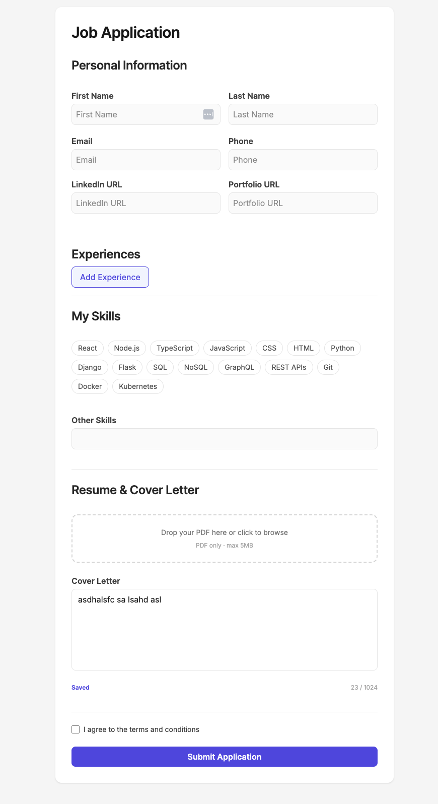

# Job Application Form

A long, multi-section job application form built to practice accessible, schema-driven forms in React: React Hook Form + Zod for validation, dynamic field arrays, async validation, draft autosave and clear error handling.

**Live demo:** _add Vercel URL here_



## What it does

- **Personal info**: name, email, phone (E.164 format) and optional LinkedIn / portfolio URLs, validated on blur.
- **Work experience**: add and remove entries dynamically (`useFieldArray`), with cross-field rules: start date must be before end date, end date is required unless "currently working", description between 50 and 500 characters.
- **Skills**: between 3 and 10 skills.
- **Resume upload**: PDF only, max 5 MB, validated in the schema.
- **Cover letter** and a required terms checkbox.
- **Submit flow**: disabled button with spinner while submitting, root-level error message for network or server failures, and the form resets on success.

## Accessibility

- Error messages are linked to their fields with `aria-invalid` and `aria-describedby`, and announced with `role="alert"`.
- An **error summary** appears at the top after a failed submit, takes focus, and each entry links to its field.
- Labels are bound to inputs, and the spinner state is exposed to assistive tech.

## Behavior worth a look

- **Schema as the single source of truth**: Zod 4 schema infers the form types; `zodResolver` connects it to React Hook Form, including `superRefine` for cross-field validation.
- **Async email check** (`useAsyncValidation`): debounced at 500 ms, cancels stale requests with `AbortController`.
- **Draft autosave** (`useAutosave`): debounced at 2 s into `localStorage`, with a saving/saved status.
- **Unsaved changes guard** (`usePreventNavigation`): warns before leaving a dirty form.
- **Mock API** with a 1-2 s delay and 30% random failures, so loading and error states are easy to see.

## Stack

| Area | Choice |
| --- | --- |
| UI | React 19, TypeScript |
| Build | Vite 8, Oxlint |
| Forms | React Hook Form, `@hookform/resolvers` |
| Validation | Zod 4 |
| Styling | Tailwind CSS 4 |

## Run it locally

```bash
npm install
npm run dev
```

Open the URL Vite prints (http://localhost:5173 by default).

## Known limitations and next steps

- The API is mocked; no real backend. Planned: replace it with typed endpoints (tRPC or a Next.js route handler) validated with the same Zod schema.
- Form state lives in React Hook Form; moving draft state to Zustand is planned but not done yet.
- A full accessibility pass is still pending: screen reader testing, color contrast check, `aria-live` toasts for submit results.
- No automated tests yet.